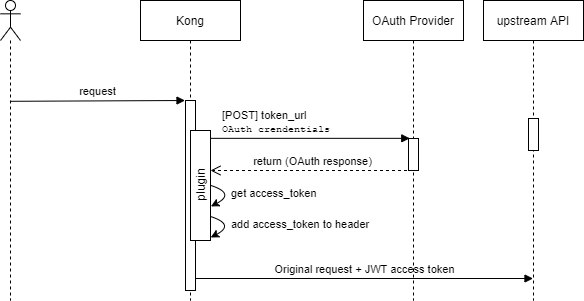

# Kong external OAuth request Plugin

This plugin performs authentication via a request to an OAuth provider.

The token is added to the request as Bearer Authentication.



> Authentication credentials are got from configuration, not from the request. Becaus of that we encourage you to add any type of security ahead this service.

## References

This project is loosely based on:
* https://github.com/be-humble/kong-ext-auth
* https://github.com/mogui/kong-external-oauth

## Setup plugin

| Parameter | mandatory | default | description |
| ---  | --- | --- | --- |
| token_url | true |    | url of the Oauth provider to request the access token |
| grant_type | false | client_credentials | Type of authentication. Currently supported: `client_credentials`, `password` |
| client_id | true | | Credentials |
| client_secret | true | | Credentials |
| username | false | | Credentials. Required if `grant_type=password` |
| password | false | | Credentials. Required if `grant_type=password` |
| header_request | false | Authorization | Header where the token will be sent upstream |
| connect_timeout | false | 10000 | Auth REST client settings |
| send_timeout | false | 60000 | Auth REST client settings |
| read_timeout | false | 60000 | Auth REST client settings |
| ssl_verify_enabled | false | false | Enable SSL verify for token request |
| cache_enabled | false | false | Enable cache for tokens. Advanced feature |
| log_enabled | false | false | Enable logs in kong output (will be printed with warn level) |

Check plugin [schema](./kong/plugins/external-oauth-request/schema.lua) for more info.


### Enable in Kong

```
curl -i -X POST \
    --url http://localhost:8001/services/example-service/plugins/ \
    --data 'name=external-oauth-request' \
    --data 'config.token_url=https://authentication-host/openid-connect/token' \
    --data 'config.client_id=AAAAAA' \
    --data 'config.client_secret=BBBBBB' \
    --data 'config.log_enabled=true'
```

### Config using k8s

Here is a sample:
```
apiVersion: configuration.konghq.com/v1
kind: KongPlugin
metadata:
  name: external-oauth-request-plugin
  namespace: test
config:
  token_url: https://authentication-host/openid-connect/token
  client_id: AAAA
  client_secret: BBBB
plugin: external-oauth-request
```

#### Using secrets

As proposed in this discussion: https://discuss.konghq.com/t/kong-plugin-config-with-secret/6986/2

There is sensible information in the config (like provider credentials) so we can use a secret to store it.

Kong plugins in this version don't allow us to get each config property from a different source. So all the config must be stored in a secret
```
apiVersion: v1
kind: Secret
metadata:
  name: auth-test-secret
  namespace: test
stringData:
  external-oauth-request-config: |
    token_url: https://authentication-host/openid-connect/token
    client_id: AAAA
    client_secret: BBBB
type: Opaque
```

And we must use the secret as our config source:
```
apiVersion: configuration.konghq.com/v1
kind: KongPlugin
metadata:
  name: external-oauth-request-plugin
  namespace: test
configFrom:
  secretKeyRef:
    name: auth-test-secret
    key: external-oauth-request-config
plugin: external-oauth-request
```

### Settings in kong

If we get this error when performing the login process:

```
"20: unable to get local issuer certificate"
```

We must add SSL certificate variables to our kong deployment

alpine based kong image:
```
KONG_LUA_SSL_TRUSTED_CERTIFICATE=/etc/ssl/cert.pem
KONG_LUA_SSL_VERIFY_DEPTH=2
```

centos based kong image:
```
KONG_LUA_SSL_TRUSTED_CERTIFICATE=/etc/pki/tls/cert.pem
KONG_LUA_SSL_VERIFY_DEPTH=2
```

For more information please refer to https://discuss.konghq.com/t/kong-log-error-about-certificate/6371/6

## Priority
By default, the priority of the plugin is 900. You can change it using an environment variable:
```
EXTERNAL_OAUTH_REQUEST_PRIORITY=1000
```

## Author

Optare Solutions
https://optaresolutions.com/
